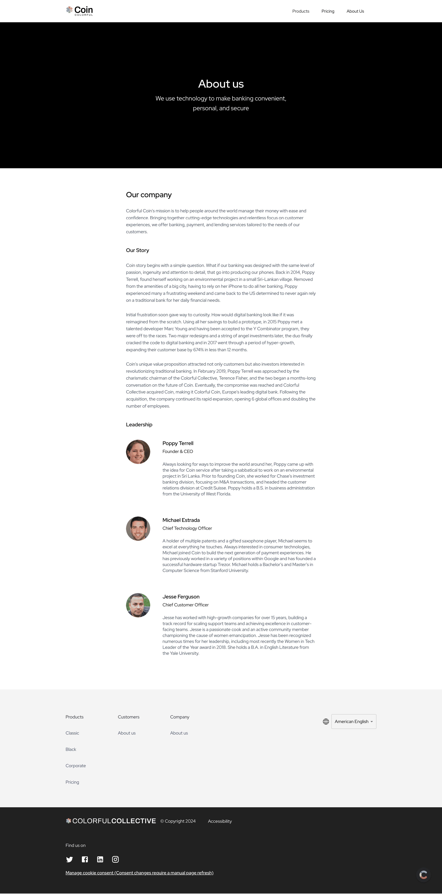

# strapi-plumejs

A plumejs application whose FE is driven by strapi CMS

To start frontend: `cd frontend && npm start`

To start cms: `cd cms && npm run develop`

### Home Page Design:

### About Page Design:

